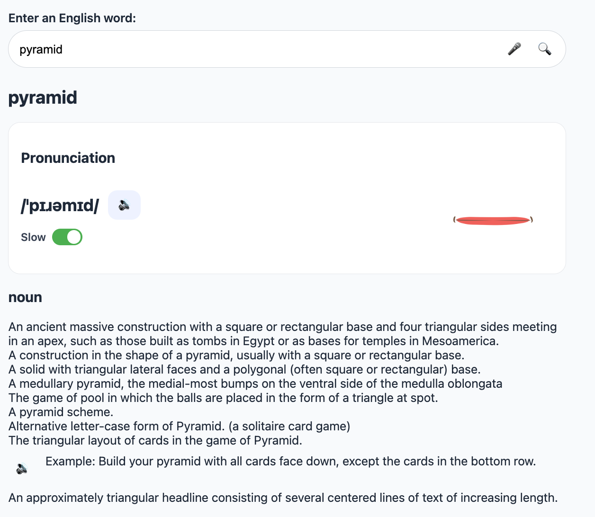
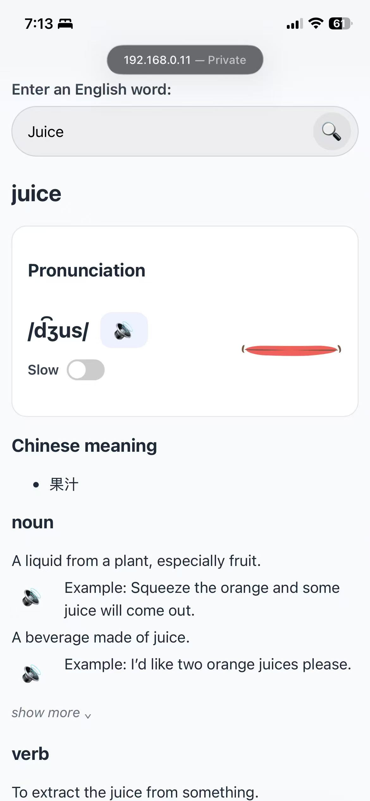

# English Pronunciation Assistant

Search a word, listen to pronunciation, practice with slow playback, and review meanings with example sentences.

## 1. Project Overview

A lightweight pronunciation learning tool designed for English learners. Users can quickly look up word pronunciations, listen to audio, practice with slow playback, and review search history.

## 2. Features

### Pronunciation

- IPA phonetics
- Audio playback
- Slow playback (0.5x)
- Mouth animation

### Learning Support

- Example sentence audio
- Chinese meanings

### Productivity

- Search history
- Voice input

## 3. Screenshots

## 4. Why I Built This

I often searched Google for word pronunciation and wanted a faster, more focused tool dedicated to pronunciation practice.

## 5. Tech Stack

- HTML
- CSS
- JavaScript
- Dictionary API
- LocalStorage
- Web Speech API

## 6. Future Improvements

- Improve mobile experience
- Expand Chinese dictionary
- Offline support
- Better pronunciation visualization

## 7. Run Locally

1. Clone the repository
2. Open the project folder in VS Code
3. Start Live Server
4. Open the generated URL in a browser

## 8. Lessons Learned

### LocalStorage

Used `localStorage` to save recent search history in the browser. This avoided adding user accounts or a backend database for a small personal tool. One limitation is that the data may be lost if the user clears browser data.

### Audio API

Used browser audio playback to play pronunciation audio returned by the dictionary API. Added slow playback by setting the audio object's `playbackRate` to `0.5`, which made pronunciation practice easier than the original `0.75` setting.

### Speech Recognition

Added voice input so users can spell words aloud. Browser support was inconsistent, especially on iPhone Safari and local IP testing, so voice input is treated as a progressive enhancement rather than a core requirement.

### Mobile Testing

Tested the app on an iPhone through VS Code Live Server using the Mac's local network IP. This helped reveal mobile-specific issues, such as layout spacing, unsupported voice input, and differences between desktop and mobile browser behavior.

### AI-Assisted Development

This project was built primarily with AI-assisted development tools, including GitHub Copilot, ChatGPT, and other coding agents.

During development, I found that AI was highly effective for implementing logic-based features such as:

- API integration
- Audio playback
- Search history
- Voice input
- Definition expansion and collapse

However, AI was less reliable for tasks involving visual design and cross-platform UI behavior.

For example:

- Generating mouth illustrations and animations was much harder than implementing the playback logic itself.
- Providing existing icons, images, or animation assets and asking AI to integrate them was often more effective than asking AI to create them from scratch.
- Mobile layouts and browser-specific behavior were more challenging than core functionality.
- A clear example was the custom clear-input button: desktop Chrome already provided a native clear button, while iPhone Safari behaved differently. Multiple attempts to implement a consistent solution introduced new layout issues without fully solving the original problem.

I also learned that AI performs better when requirements are communicated visually. Simple sketches, layout diagrams, or screenshots often produced more accurate results than text descriptions alone.

Another important lesson was tool reliability. Development temporarily slowed when GitHub Copilot free usage limits were reached and paid upgrades were unavailable. This highlighted the importance of having backup tools and workflows rather than relying on a single AI coding assistant.

Overall, the most effective workflow was:

- Let AI generate and explain code.
- Review and understand the generated code.
- Test frequently on real devices.
- Use small, incremental changes.
- Roll back and retry when AI-generated changes introduced unexpected behavior.

### Managing AI-Generated Changes

One challenge I encountered was preserving intentional product decisions across multiple AI-generated iterations.

For example, after testing pronunciation playback speeds, I decided to use 0.5x speed instead of the originally discussed 0.75x speed because it was easier for learners to follow.

However, in a later iteration, an AI coding assistant automatically changed the value back to 0.75x while working on an unrelated feature. This happened because the AI viewed the value as an implementation detail rather than a previously validated product decision.

From this experience, I learned several practices that improved development stability:

- Explicitly tell AI not to modify existing approved functionality.
- Make feature requests as small and focused as possible.
- Keep each change limited to a single feature or improvement.
- Commit frequently after a working feature is completed.
- Record important product decisions so they can be preserved across future iterations.
- Review AI-generated changes before accepting them rather than assuming they are always improvements.

These practices reduced unintended regressions and made AI-assisted development more predictable.
